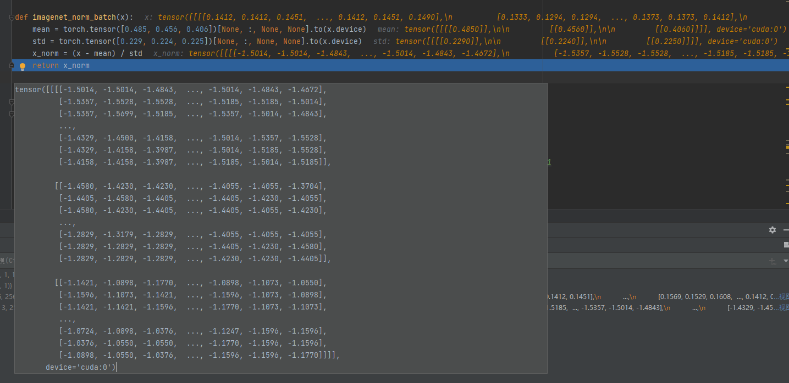

# v240421-1615

* 模型文件提取码:

  链接：https://pan.baidu.com/s/1Tt4gXlIADZosZGCgX2vd6g?pwd=66eo 
  提取码：66eo

  下载`models.zip`文件后, 将模型文件放入`models`文件夹下:

  ```
  datas
  |-- images
  |-- models
  ```

  

* 删除了一些`yolov5`修改而来中冗余的代码;

# v240418-1615

* 基于tensorrtx下的yolov5的修改而来;

  目前代码和文件有些冗余, 一些多余无用的文件没有还没删除赶紧;

* 总体结构已经完成, 已经可以正常导出异常图 (8bit) 和热力图;


# torch-data

input:


ImageNetNormal:




teacher:


teacher_output_normal:


student:


distance_student&teacher:


AE:


distance_st:


distance_stae:

