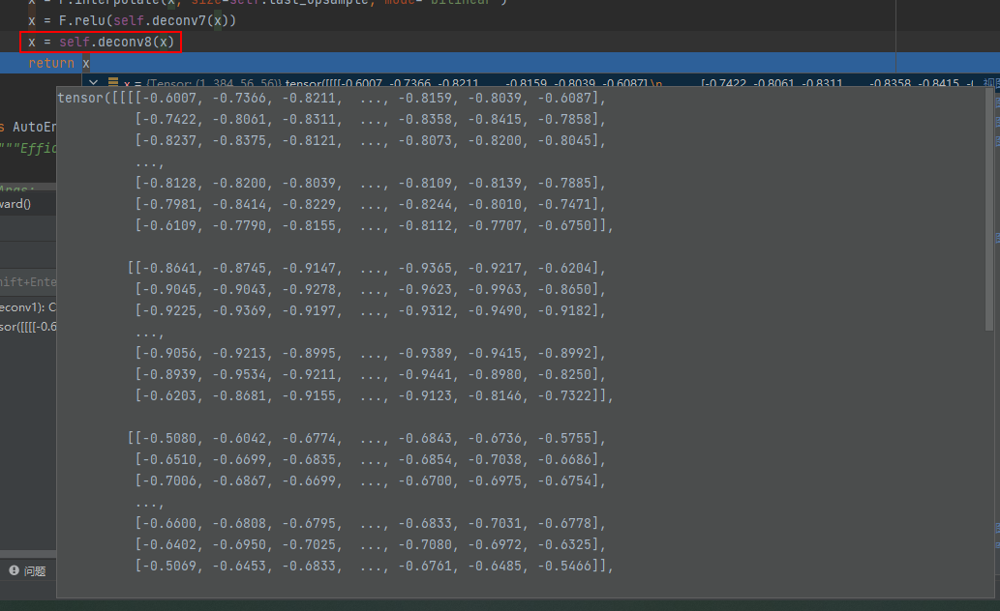

# v240418-1615

* 基于tensorrtx下的yolov5的修改而来;

  目前代码和文件有些冗余, 一些多余无用的文件没有还没删除赶紧;

* 总体结构已经完成, 已经可以正常导出异常图 (8bit) 和热力图;

# torch-data

input:

ImageNetNormal:

teacher:

teacher_output_normal:

student:

distance_student&teacher:

AE:

distance_st:

distance_stae:

